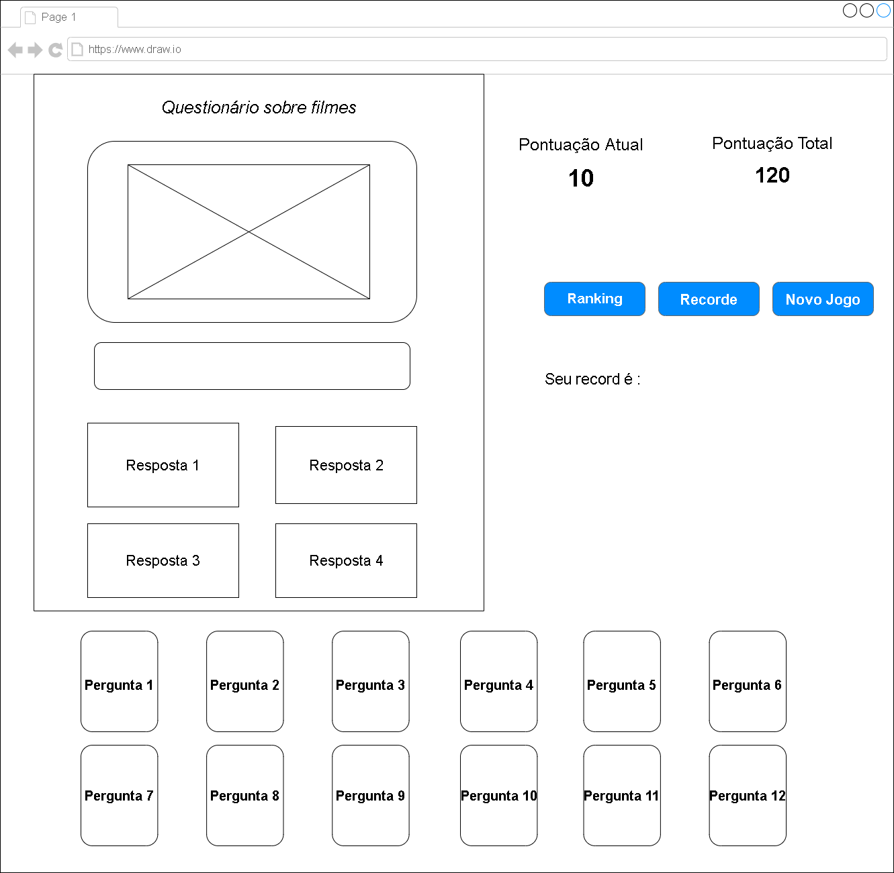
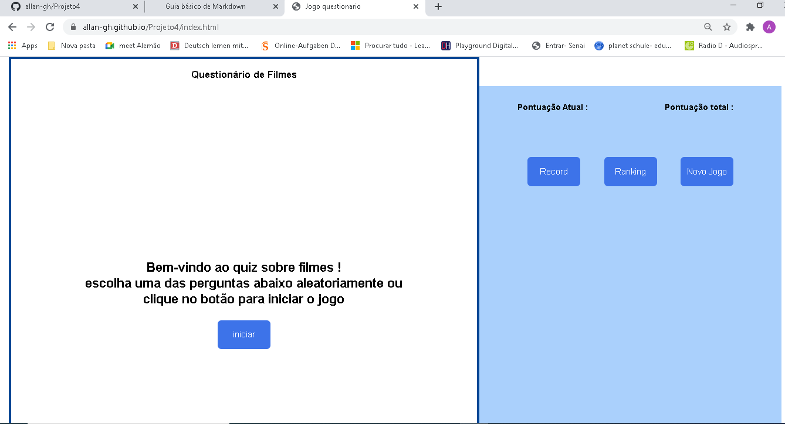
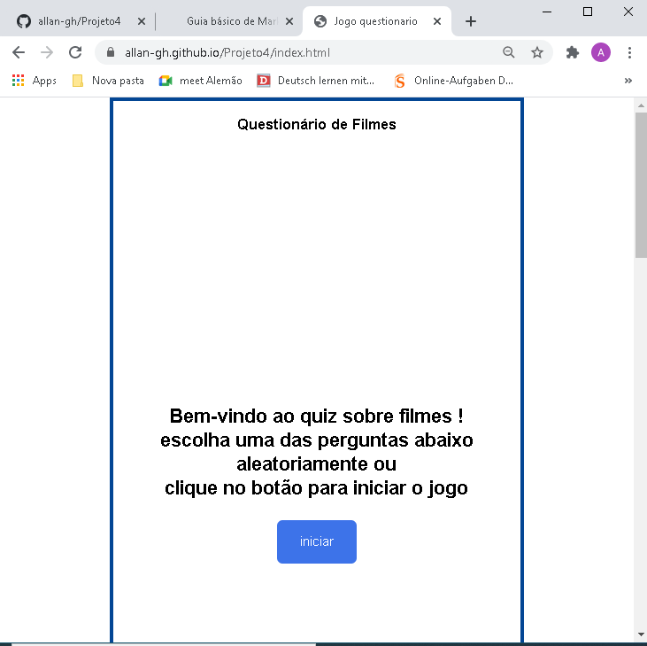
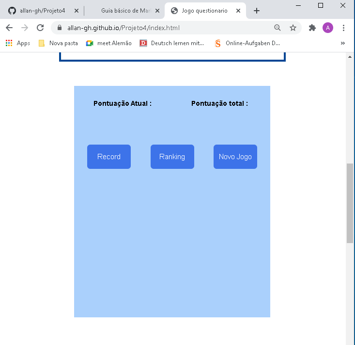

# Jogo quiz

## Introdução

Trabalho para o fechamento do primeiro semestre da matéria de Lima . 

A proposta era elaborar um quiz com no mínimo 12 perguntas de múltipla escolha  dispostas em cards

O trabalho foi dividido em três etapas :

1. Wireframe (planejamento de layout)
2. Página estática (html + css)
3. Página final (html + css + javascript)

---
## 1 - Wireframes

O canto esquerdo é a área da página inicial onde as questões aparecerão. Cada uma das doze perguntas possuem uma imagem , um questionamento e 4 opções de resposta.

 

Na seção ao lado, fica disponível um campo para acompanhar a pontuação, assim como os recursos de **ranking**, **Novo jogo** e **salvar pontuação**.

 
Já na parte inferior da página esta o deck de pergunta . Este deck permite que o usuário escolha a ordem com que deseja responder as questões. 

 
 

### **Responsividade**
O site é capaz de se adptar em diferentes tamanhos da janela do navegador e possui uma adptação razoável em relação a telas de celular.

 

Janela inteira do navegador :

 

Janela parcial do navegador :

---

 

## 2 - Página Estática (html + css)
Esta etapa do projeto tinha como objetivo elaborar o documento html e estilizá-lo com css. Dessa forma, os botões presentes na página não funcionarão  devido a ausencia de javascript até esse ponto.

Confira a página estática : <https://dev-allansantos.github.io/Projeto4/paginaEstatica.html>

 
 

---
 

## Manual do Jogo

para saber sobre o funcionamento do jogo assim como o funcionamento do site  acesse  o manual clicando no endereço abaixo:

<https://dev-allansantos.github.io/Projeto4/arquivoWord/manual.docx> 

 
 

---
 

## Página Final
Essa etapa se caracteriza pela adição do javascript permitindo que o usuário comece a jogar

Acesse a página final e tente responder ao quiz :

https://dev-allansantos.github.io/Projeto4/index.html

